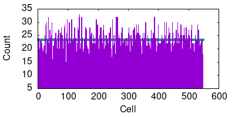

# Funcionalidad

## Indexado
\tiny
```
$ time pseudo-python -O personal_library.py --create books

# Creating index...
Laoding documents...
Loading:  Bidirectional LSTM-CRF Models for Sequence Tagging.txt
Loading:  DNA vaccines_ prime time is now.txt
...
Loading Complete
Computing index...
Save index...
Save directory...
Size:  500
Max collisions:  38.0
Elements:  11471
Median:  23
Load factor:  22.942
Done

real    0m9.621s
user    0m9.033s
sys     0m0.070s
```
\normalsize

# Funcionalidad

## Consulta

\tiny
```
$ time pseudo-python -O personal_library.py --search network

Searching: network
Load index...
Load directory...
Freq	relevance	Title
56	0.0018238144110960361	reviewtxt_comprehensive_a_classification_text_learningbased_deep
37	0.004781216569857937	taggingtxt_sequence_for_models_lstmcrf_bidirectional
26	0.005605544850562544	networktxt_neural_convolutional_a_of_understanding
5	0.000520068412785073	prospectstxt_and_perspectives_trends_learning_machine
2	6.359148445504086e-05	reviewtxt_scientific_a_diabetes_and_health_of_determinants_social
1	0.0008536295327092922	covidtxt_and_diabetes

real	0m0.274s
user	0m0.251s
sys	0m0.023s
```
\normalsize

# Funcionalidad

::: columns

:::: column

## Relevancia `tf-idf`

$$
\text{tf}(t, d) = \frac{f_{t,d}}{\sum_{t' \in d} f_{t',d}}
$$

$$
\text{idf}(t, D) = \log \frac{|D|}{|\{d \in D, t \in d\}|}
$$

- Resultados relevantes
- Usada en el 83% de los sistemas de recomendación de texto.

::::

:::: column

## Frecuencia

$$
f_{t,d} = \frac{|\{t' \in d, t' = t\}|}{|\{t' \in d\}|}
$$

- Fácil de computar.
- Favorece documentos largos.

::::
:::

# Funcionamiento Indexado

## Document

- Identificador numérico. : `Int`
- Título : `String`
- Contenido : `LinkedList[String]`

# Funcionamiento Indexado

## Aclaración sobre la matriz `tf-idf`.

- **No** es un `Array` 2D
- **Es** un mapeo `String -> TfIdfRow` donde la llave es un término.

## `TfIdfRow`

`LinkedList[(doc-id, frequencia, relevancia)]`

# Funcionamiento Indexado

## Cañería

```
folder name =>
	LinkedList[Document] =>
	(
		TF :: Dic[String, int] =>
		Matrix TF-IDF :: Dic[String, TfIdfRow]
	) => Serialization
```

# Tabla Hash

## Funciones de Hash

-  Método de multiplicación

- Polynomial Rolling Hash: Horner's method:
	- Divide el polinomio en monomios
	- Evita desbordamiento de enteros

# Tabla Hash

## Estructura

- Tamaño de 547
- Colisiones resueltas por encadenamiento

# Tabla Hash

## Grafico colisiones y celdas



# Tabla Hash

## Estructura

- Load factor: 21
- Cantidad máxima de colisiones: 38
- Mediana: 21

## Conclusión

- Idealmente todos los slots deberian tener 21 colisiones

- La mediana nos da un resultado realista y aceptable


# Serialización

## Persist.py

Módulo escrito para guardar estructuras utilizadas:

```
    Array
    String
    LinkedList
    Document
    Dic
    TfIdfRow
```

# Serialización

::: columns

:::: column

## Propósito

- Formato legible, etiquetas
- No ejecuta código malicioso

::::

:::: column

## Problemas

- Archivos relativamente grandes
- \textbf{Lento} en la carga

::::
:::

# Serialización

## Ejemplo de salida

\tiny
```
!pyObj<Dic>{Array}{547}
  - !pyObj<int>{}{}
    - 547
  - !pyObj<function>{}{547}
    - multiplicative_hash_function
  - !pyObj<Array>{LinkedList}{547}
    - !pyObj<LinkedList>{Tuple}{2}
      - !pyObj<String>{}{}
        - raise
      - !pyObj<LinkedList>{Tuple}{2}
        - !pyObj<Tuple>{float}{}
          - 0.3453479832123
        -!pyObj<int>{}{}
          - 4
      - !pyObj<LinkedList>{Tuple}{2}
        - !pyObj<Tuple>{float}{}
        ...
```
\normalsize

# Serialización

## JSON

- Soluciona problemas anteriores
- Costo: convertir las estructuras a diccionarios Python

# Serialización

## Ejemplo de salida
\tiny
```
{"those": [[3, [1, 5.670965996701542e-05]], [4, [1, 2.6240868853476483e-05]], [7, [1, 8.56653464
2388508e-06]], [8, [1, 0.00022453393693836772]], [0, [4, 0.0001094367087598767]], [1, [6, 6.4591
95446172223e-05]], [2, [7, 0.00021352700310484896]], [5, [13, 0.00030547496305212136]], [6, [32,
0.0004277965843530244]], [11, [34, 0.0002843547216052503]]], "adding": [[0, [1, 0.00016485778641
478236]], [3, [1, 0.00034171455324046956]], [7, [1, 5.1619240176108156e-05]], [11, [1, 5.0395059
113216046e-05]]], "establish": [[0, [1, 0.00026887146897179695]], [11, [4, 0.0003287632053629458
7]]], "ot": [[10, [2, 0.0009265125465279643]]], "flows": [[7, [1, 0.00011675546914382373]]],...}
```
\normalsize

# Conclusion
diccionario python
- And the answer is...
- $f(x)=\sum_{n=0}^\infty\frac{f^{(n)}(a)}{n!}(x-a)^n$  

# Links

- [tf-idf](https://en.wikipedia.org/wiki/Tf%E2%80%93idf), https://en.wikipedia.org/wiki/Tf%E2%80%93idf
